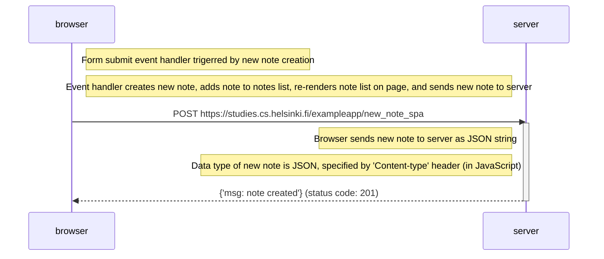

```mermaid
sequenceDiagram
participant browser
participant server

Note right of browser: Form submit event handler trigerred by new note creation
Note right of browser: Event handler creates new note, adds note to notes list, re-renders note list on page, and sends new note to server

browser->>server: POST https://studies.cs.helsinki.fi/exampleapp/new_note_spa
activate server

Note left of server: Browser sends new note to server as JSON string
Note left of server: Data type of new note is JSON, specified by 'Content-type' header (in JavaScript)

server-->>browser: {'msg: note created'} (status code: 201)
deactivate server
```